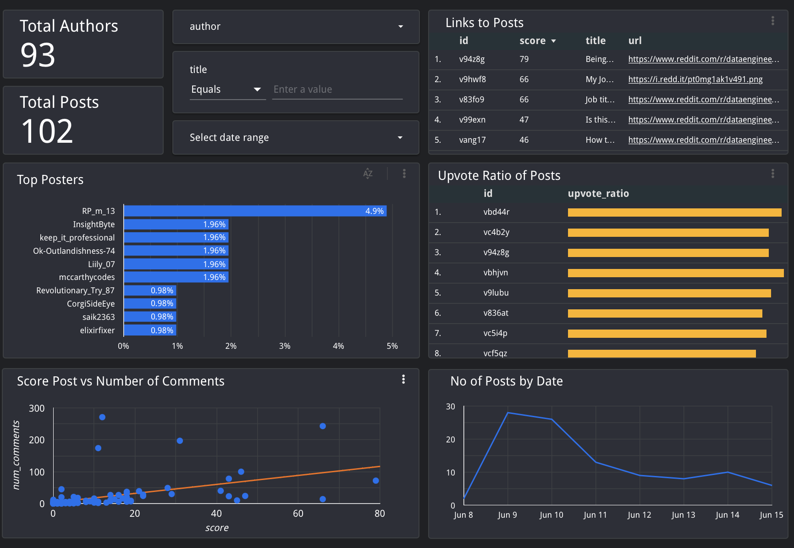

# Reddit ETL Pipeline

A data pipeline to extract Reddit data from 'r/dataengineering'.

Output is a Google Data Studio report, providing insight into the Data Engineering official subreddit.

## Architecture


1. Extract data using Reddit API
1. Load into AWS S3
1. Copy into AWS Redshift
1. Transform using dbt
1. Create Google Data StudioDashboard 
1. Orchestrate with Airflow in Docker
1. Create AWS resources with Terraform

## Output




## Setup

Follow below steps to setup pipeline. I've tried to explain steps where I can. Feel free to make improvements/changes. 

First clone the repository into your home directory and follow the steps.

  ```bash
  git clone https://github.com/ashrithvm/Reddit-ETL-Analytics-Dashboard.git
  ```


# Overview

This pipeline was designed not only to create a dashboard, but to gain exposure to a range of tools, develop new skills, and hopefully provide help to others.

## How this pipeline works

There is one DAG (pipeline) running which extracts Reddit data from its API using Python's [PRAW](https://praw.readthedocs.io/en/stable/) API wrapper. 

It is setup to extract data from the past 24 hours and store in a CSV with fields such as post ID, author name, and so forth.

This CSV is then loaded directly into an AWS S3 bucket (cloud storage) before being copied to AWS Redshift (cloud data warehouse).

This entire process is running with Apache Airflow (orchestration tool) running with Docker. This saves us having to manually setup Airflow. 

Another two components make up this project that are not controlled with Airflow. 

* First, we use dbt to connect to our data warehouse and transform the data. We're only using dbt to gain some familiarity with it and build our skills.

* Second, we will connect a BI tool to our warehouse and create some visualisations. I recommend Google Data Studio, but feel free to use something else.

Proceed to the next step to get started.

## Reddit API

For this project we'll be taking data from Reddit. Specifically, the `r/DataEngineering` sub. 

> Feel free to change the subreddit in the extract_reddit_etl.py script.

To extract Reddit data, we need to use its Application Programming Interface ([API](https://www.mulesoft.com/resources/api/what-is-an-api)). There's a couple steps you'll need to follow to set this up.

1. Create a [Reddit account](https://www.reddit.com/register/).
2. Navigate [here](https://www.reddit.com/prefs/apps) and create an app. Make sure you select "script" from the radio buttons during the setup process.
3. Take a note of a few things once this is setup:

    - the App name
    - the App ID
    - API Secret Key

# AWS

We'll be using the cloud to store our Reddit data; specifically, Amazon Web Service (AWS) which offers a free tier.

We're going to be using 2 services:

* [Simple Storage Service (S3)](https://aws.amazon.com/s3/)  ~ This is Object Storage. When we extract data from Reddit, we'll store it in a CSV and push to an S3 Bucket as an object (think of a Bucket as a bit like a folder and an object as a file). This allows us to store all our raw data in the cloud.

* [Redshift](https://aws.amazon.com/redshift/) ~ This is a Data Warehousing service. Utilising its Massively Parallel Processing (MPP) technology, Redshift is able to execute operations on large datasets at fast speeds. It's based on PostgreSQL, so we can use SQL to run operations here.

In our case, we'd be fine to use a local database like PostgreSQL. However, it's good practice to work with cloud tools like this.


## AWS Account Setup

1. Setup a personal [AWS account](https://portal.aws.amazon.com/billing/signup?nc2=h_ct&src=header_signup&redirect_url=https%3A%2F%2Faws.amazon.com%2Fregistration-confirmation#/start).

2. Setup CLI.

# AWS Infrastucture <a name="SetupsRedshift"></a>

We'll use an infrastructure-as-code tool called `Terraform`. This will allow us to quickly setup (and destroy) our AWS resources using code. 


We'll use Terraform to create:

* **Redshift Cluster**

    *Redshift is a columnar data warehousing solution offered by AWS. This will be the end destination for our data.*

* **IAM Role forRedshift**

     *Role we assign to Redshift which will give it permission to read data from S3.*

* **S3 Bucket**

    *Object storage for our extracted Reddit data.*

* **Security Group**

    *This particular security group will be applied to Redshift, and will allow all incoming traffic so our dashboard can connect to it. NOTE: In a real production environment, it's not a good idea to allow all traffic into your resource.*

## Setup

1. Install Terraform 

    You can find installation instructions [here](https://learn.hashicorp.com/tutorials/terraform/install-cli) for your OS.

1. Change into `terraform` directory

    ```bash
    cd ~/Reddit-API-Pipeline/terraform
    ```

1. Open the `variables.tf` file

1. Fill in the `default` parameters.

1. May be a good idea to amend `.gitignore` to ignore all terraform files so you don't accidentally commit your password and other details. You'll need to remove the `!*.tf` line.

1. Making sure you are still in the terraform directory, run this command to download the AWS terraform plugin:

    ```bash
    terraform init
    ```

1. Run this command to create a plan based on `main.tf` and execute the planned changes to create resources in AWS:

    ```bash
    terraform apply
    ```

1. (optional) Run this command to terminate the resources:

    ```
    terraform destroy
    ```


# Configuration

Next, you'll need to create a configuration file with your details. The extract and load scripts in our pipeline will utilise the details here.

## Setup

1. Create a configuration file under `~/Reddit-API-Pipeline/airflow/extraction/` called `configuration.conf`:

    ```bash
    touch ~/Reddit-API-Pipeline/airflow/extraction/configuration.conf
    ```

1. Copy in the following:

    ```conf
    [aws_config]
    bucket_name = XXXXX
    redshift_username = awsuser
    redshift_password = XXXXX
    redshift_hostname =  XXXXX
    redshift_role = RedShiftLoadRole
    redshift_port = 5439
    redshift_database = dev
    account_id = 
    aws_region = us-east-1

    [reddit_config]
    secret = XXXXX
    developer = XXXXX
    name = XXXXX
    client_id = XXXXX
    ```


1. Change `XXXXX` values

    * If you need a reminder of your `aws_config` details, change folder back into the terraform folder and run the command. It will output the values you need to store under `aws_config`. Just be sure to remove any `"` from the strings.

        ```bash
        terraform output
        ```
        
    * For `reddit_config` these are the details you took note of after setting up your Reddit App. Note the `developer` is your Reddit name.

# Docker & Airflow

We're going to run our pipeline daily, for demonstration purposes, although this could be changed at a later point. Each day, we'll extract the top Reddit posts for `r/DataEngineering`. Because `LIMIT` is set to `None` in the Reddit extraction script, it should in theory return all posts from the past 24 hours. Feel free to play around with this.

## Airflow

To orchestrate this, we'll use Apache Airflow, which allows us to define [DAGs](https://en.wikipedia.org/wiki/Directed_acyclic_graph). Although Airflow is overkill in our case, consider it good practice. It will allow us automate our extraction and loading within our pipeline.

## Docker

Another tool we'll use is Docker. This allows us to create and maintain 'containers'. Think of a container a bit like a special kind of virtual machine which, in our case, includes everything we need to run Airflow, bypassing the need to install a load of dependencies.


## Airflow in Docker Info

For this project, the `docker-compose.yaml` file comes from the Airflow in Docker quick-start guide [here](https://airflow.apache.org/docs/apache-airflow/stable/start/docker.html). This defines all the services we need for Airflow, e.g., scheduler, web server, and so forth.

When we run this docker-compose file further down, it will start our containers/services. I've only changed a few things in this file:

* These two extra lines added under `volumes` will mount these folders on our local file system to the docker containers. The first line below mounts our `extraction` folder to `/opt/airflow`, which contains the scripts our airflow DAG will run. The second line mounts our aws credentials into the docker containers as read only.

    ```yaml
    - ./extraction:/opt/airflow/extraction
    - $HOME/.aws/credentials:/home/airflow/.aws/credentials:ro
    ```

* This line pip installs the specified packages within the containers. Note that there are others ways we could have done this.

    ```yaml
    _PIP_ADDITIONAL_REQUIREMENTS: ${_PIP_ADDITIONAL_REQUIREMENTS:- praw boto3 configparser psycopg2-binary}
    ```

### Installing Docker <a name="Docker"></a>

1. First install Docker. Instructions [here](https://docs.docker.com/get-docker/).

1. Next install Docker Compose. Instructions [here](https://docs.docker.com/compose/install/.).

### Running Airflow <a name="Airflow"></a>

To start our pipeline, we need to kick off Airflow which requires a couple more prerequisite steps.

1. If using Windows, you may need to make a small update to the below line in the `docker-compose.yaml` file. Here we are mounting our aws credentials file on to a docker container.

    ```yaml
    - $HOME/.aws/credentials:/home/airflow/.aws/credentials:ro
    ```

1. Increase CPU and Memory in Docker Desktop resource settings to whatever you think your PC can handle.

1. Run the following. You may be able to skip this step if you're not on linux. See [here](https://airflow.apache.org/docs/apache-airflow/stable/start/docker.html) for more details.

    ```bash
    cd ~/Reddit-API-Pipeline/airflow
    
    # Create folders required by airflow. 
    mkdir -p ./logs ./plugins

    # host user id
    echo -e "AIRFLOW_UID=$(id -u)" > .env
    ```

1. Making sure you are still in the airflow directory, initialise the airflow database. This will take a few minutes. Make sure the Docker daemon (background process) is running before doing this. 

    ```bash
    docker-compose up airflow-init
    ```

1. Create our Airflow containers. This could take a while. You'll know when it's done when you get an Airflow login screen at http://localhost:8080.

    ```bash
    docker-compose up
    ```

1. If interested, once containers are created, you can view them in Docker Desktop, or list them from the command line with:

    ```bash
    docker ps
    ```
1. You can even connect into a docker container and navigate around the filesystem:

    ```bash
    docker exec -it <CONTAINER ID> bash
    ```

1. As mentioned above, navigate to `http://localhost:8080` to access the Airflow Web Interface. 

1. The dag `etl_reddit_pipeline` should be set to start running automatically once the containers are created.

1. If you want to shut down the airflow containers, run the following command from the airflow directory:

    ```bash
    docker-compose down
    ```

## Explanation

If you check in the `airflow/dags` folder, you'll find a file titled `elt_reddit_pipeline.py`. This is our DAG which you saw in Airflow's UI. 

It's a very simple DAG. All it's doing is running 3 tasks, one after the other. This DAG will run everyday at midnight. It will also run once as soon as you create the Docker containers. 

Read below for more details:

1. `extract_reddit_data_task`
    This is extracting Reddit data.

1. `upload_to_s3`

    This is uploading the newly created CSV to AWS S3 for storage within the bucket Terraform created.

1. `copy_to_redshift`

    This is creating a table in Redshift if it doesn't already exist. It's then using the COPY command to copy data from the newly uploaded CSV file in S3 to Redshift.

# Data Building Tool

dbt (data build tool) is a transformation tools that sits on top of our data warehouse.

In production, this could be used to create multiple different tables with different columns. Data scientists might be given access to one table, and data analysts the other, as an example. dbt would be able to run tests when creating these new tables, produce documentation for analysts to examine, help manage dependencies between models, and so forth.

If you continue, I'd recommend taking a quick look at some dbt [tutorials](https://docs.getdbt.com/docs/dbt-cloud/cloud-quickstart). I'll only go through some basic steps to setup a transformation here.

For reference, here's a [link](https://github.com/ABZ-Aaron/Reddit-API-Pipeline-DBT) to the separate repo I set up for dbt.

## Setup (development)

1. Create a dbt account [here](https://www.getdbt.com/signup/).

1. Create a project or just stick to the default project created.

1. Setup Up a `Database Connection` - Select Redshift

1. On the next page, enter the relevant Redshift details. Once everything is input, click the `Test` button at the top. If successful, click `Continue`. 

1. Once connection is established, choose `managed directory` and give it  a name.

1. Once you've worked through these initial steps, click on `Start Developing`.

You are now in an IDE which is connected to your Redshift cluster. Here we'll run some basic transformations on our data.

1. Click on `initialize project`. This will populate the directory on the left hand side with folder and files we may need.

1. Under the `models` folder, create new files called `reddit_transformed.sql` (this name will be the name of the new model you create) and `schema.yml`. You can delete the `example` folder.

1. In the `schema.yml` file, copy the following and save. You can see that I've added a `not_null` test for `id`. For the rest, I've only added in the name of the column and a description.

    ```yaml
    version: 2

    models:
      - name: reddit_transformed
        description: Transformed Reddit Data
        columns:
          - name: id
            description: Reddit ID of Post
            tests:
              - not_null
          - name: title
            description: Title of Reddit Post
          - name: text
            description: Body Text of Reddit Post
          - name: score
            description: Score of Reddit Post
          - name: comments
            description: Number of Comments for Post
          - name: url
            description: Full URL of Reddit Post
          - name: comment
            description: Top comment for Reddit Post
          - name: dateposted
            description: Date Reddit Data was Downloaded
    ```
1. In the `text_posts.sql` file, copy the following and save. This wil be our only transformation. This is basically removing some columns that don't really need, and also splitting the UTC datetime column into `utc_date` and `utc_time`. Feel free to transform the data in whichever way you want. This is just a VERY basic example.

    ```SQL
    SELECT id, 
       title, 
       num_comments, 
       score,
       author,
       created_utc,
       url,
       upvote_ratio,
       created_utc::date as utc_date,
       created_utc::time as utc_time
    FROM dev.public.reddit
    ```

1. If you check the bottom right of the screen, you'll see a preview button. Click this to see what your outputted table will look like based on the above SQL query. Basically, when we run `dbt run` in the UI (further down this page) what'll happen is this table will be created in a new schema within our Redshift database.

1. Under the `dbt_project.yml`, update it to the following. All we've really changed here is the project name to `reddit_project` and told dbt to create all models as tables (rather than views). You can leave it as views if you wish.

    ```yaml
    name: 'reddit_project'
    version: '1.0.0'
    config-version: 2

    profile: 'default'

    model-paths: ["models"]
    analysis-paths: ["analyses"]
    test-paths: ["tests"]
    seed-paths: ["seeds"]
    macro-paths: ["macros"]
    snapshot-paths: ["snapshots"]

    target-path: "target"  # directory which will store compiled SQL files
    clean-targets:         # directories to be removed by `dbt clean`
      - "target"
      - "dbt_packages"

    models:
      reddit_project:
        materialized: table
    ```

1. To test what we've done, we can run the following commands at the bottom of the DBT IDE and make sure an error isn't returned:

    ```bash
    dbt run
    ```
      
    ```bash
    dbt test
    ```

1. `dbt run` will generate our table within a different schema in Redshift. Easiest way to see this is to navigate to the AWS Console, login, search for Redshift, and use the Query Editor V2. `dbt test` will check the new model passes the tests (or test in our case) specified in the `schema.yml` file.

1. The next step is to click `commit` on the left hand menu to commit our changes.


If you ran `dbt run` above and no error was returned, a new table will have been created in our Redshift database, under a new schema name. You would have specified this schema name during the initial setup of dbt during the Redshift connection phase. If you left it as the default, it'll likely be something like `dbt_<dbt user name>`.

To check this, navigate to your Redshift cluster in AWS, and click on Query Data on the top right (orange button). Here, you want to navigate to the `dev` database, select the relevant schema, and check that the new table is there. You can query it with:

```sql
SELECT * FROM <schema name>.reddit_transformed;
```

## Setup (production)

When you working in your DBT development environment, this is where the models are created.

However, consider this schema to be our development environment. We now want to setup a production run, as we wouldn't want analysts accessing our models from within our development area.

1. To do this, navigate to the left hand side menu and select `Environments` then click `New Environments`.

1. The `Type` option should be set to `Deployment`. Change the `Name` to something like `Production Run`.
1. Under `Deployment Credentials` enter your database username and password again. Also set a schema name, something like `Analytics`, and Save.
1. Click on `New Job`.
1. Give your job a name. Set environment as the `Production Run` you just created.
1. Select the `Generate Docs` radio button.
1. Under `Commands` ensure that `dbt run` and `dbt test` are both there.
1. Under `Triggers` ,normally you'd have this on a schedule, but for our purposes, just de-select so that it does not run on a schedule. We'll just run it manually for now.
1. Scroll to the top and save. Once saved, click `Run Now`. After a minute or two, you can then check the Redshift cluster, where you should find a new schema folder with our production table/model!

## Termination

To terminate your resources, follow the below steps:


1. Terminate your AWS resources by running the following Terraform command under the terraform directory:

    ```bash
    terraform destroy
    ```

    You can then check in the AWS console that Terraform has done it's job of deleting all the resources we created earlier.


1. Stop and delete containers, delete volumes with database data and download images. To do so, navigate to the `airflow` directory you first ran `docker-compose up` and run the following:

    ```bash
    docker-compose down --volumes --rmi all
    ```

1. The following command removes all stopped containers, all networks not used by at least one container, all unused images, all volumes, and all dangling build cache:

    ```bash
    docker system prune -a --volumes
    ```

1. Delete your DBT account if you wish, along with any EC2 instances you may have setup. 


## Credit

This project was heavily influenced by https://github.com/AnMol12499/Reddit-Analytics-Integration-Platform/tree/main.

I cloned the core infrastructure and improved upon it. It was amazing experience to work with a diverse and industry standard tech stack. The work is well documented and it almost felt like I was doing a guided project in the first part. I'd recommend going through the original repo and starring it.

